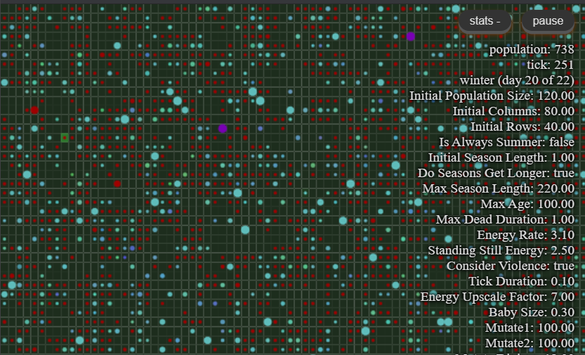
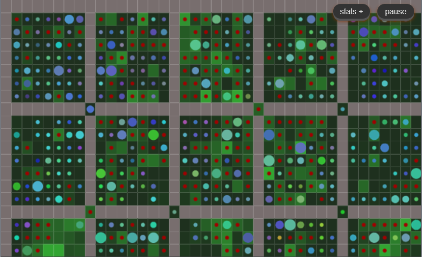

# Some-Life

[**TRY THE LIVE DEMO**](https://secretgeek.github.io/some-life/)

This is a simulation of evolving life.

(*Tech note:* it is written in vanilla typescript and compiled to javascript. The graphics are displayed using a html canvas)

Here is the general idea, and then I'll give general future plans before going deep into the specifics.

## The General Idea

There is a grid of little squares, and each grid contains grass. The grass keeps growing at a steady rate.

There are animals wandering around on the grass. Each animal takes turn moving. Here's what an animal does in 1 turn.

It looks at all the grass around it, and possibly moves to the best piece of grass. Then it munches the grass.

Then it looks around and if it sees a good candidate mate, then it may produce a baby. The baby will be placed on the best available empty square.

The baby will have genes from each parent, roughly 50% from each.

The genes control every specific detail of the animal's behavior. There are about 13 genes at the moment, but as the code grows more genes will be added.

## General future plans

I'd like to use it to test more ideas. For example all of the animals are herbivorous at the moment. But I think they could have genes that allows them to eat other animals. And to scavenge dead animals. It might not sound very exciting when you just read about it, but it can lead to a lot of different behavior. 

If the animals have more situational awareness they may be able to perform more complex strategies, and these could also be determined by genes. I want to explore various strategies to see if any "[Evolutionarily Stable Strategies](https://en.wikipedia.org/wiki/Evolutionarily_stable_strategy)" emerge.

I would also like to add some graphing capabilities and more visualization capabilities.

## Specifics about this implementation.

On the opening screen you can configure two types of things:

1. "World Settings" -- Which control the way this little world works
2. "Default (starting) gene values" -- which list the genes and let you set the valus for the initial population. Where they end up after that will depend on evolution itself.

### World Settings

The World Settings are:

  - [Initial Population Size](#initial-population-size)
  - [Initial Columns](#initial-columns)
  - [Initial Rows](#initial-rows)
  - [Is Always Summer](#is-always-summer)
  - [Initial Season Length](#initial-season-length)
  - [Do Seasons Get Longer](#do-seasons-get-longer)
  - [Max Season Length](#max-season-length)
  - [Max Age](#max-age)
  - [Max Dead Duration](#max-dead-duration)
  - [Energy Rate](#energy-rate)
  - [Standing Still Energy](#standing-still-energy)
  - [Consider Violence](#consider-violence)
  - [Tick Duration](#tick-duration)
  - [Energy Upscale Factor](#energy-upscale-factor)
  - [Baby Size](#baby-size)
  - [Mutate1](#mutate1)
  - [Mutate2](#mutate2)
  - [Mutate Divisor](#mutate-divisor)
  - [Allow Walls](#allow-walls)
  - [Draw Box Walls](#draw-box-walls)
  - [Draw Corridor](#draw-corridor)
  - [Box Wall Size](#box-wall-size)
  - [Delay](#delay)
  - [Verbose Log](#verbose-log)

#### Initial Population Size

How many animals should be created.

#### Initial Columns

How many cells wide will the world be. (Note cells will be stretched to fill the whole screen)

#### Initial Rows

How many cells tall will the world be.

(Note that a message will be written to the browsers console to tell you what an ideal number of rows would be, given the number of columns you chose, if you wish to have square-looking cells)

#### Is Always Summer?

Instead of having the grass constantly grow, you can turn this option off, and have two seasons: summer and winter. During summer, the grass grows steadily, during winter: the grass stops growing. 

#### Initial Season Length

If it is not always summer then this number is used for the length of summer. (And summer and winter are the same length)

#### Do Seasons Get Longer?

Turn this on and seasons will get 1 tick longer each time they occur. This is a fun way to steadily increase the amount of stress on the population, watch their numbers fall during winter. 

#### Max Season Length

If you specify a max season length, then seasons will stop getting longer when they reach this length.

#### Tick Duration

While seasons are measured in ticks, some other things are measured in 'years'. "Tick duration" tells you how many years long is one tick.

#### Max Age

How old, approximately, can animals live, in years. The default is 100 years, and since the default tick duration is 0.1, this means an animal will live approximately 1000 ticks. In practice, some randomness is applied so that each animals maximum age is between 80% and 120% of the official max age. This randomness prevents entire groups of animals dying simultaneously, after a boom in the population.

#### Max Dead Duration

When an animal dies, how long does the body "hang around" (in years) before it dissappears. This is to allow for future plans with scavenging etc.

#### Energy Rate

How fast does the grass grow (in summer)? How many units of energy are added to each square of grass on every tick.

####  Standing Still Energy

If an animal doesn't move it will still burn up energy. How much energy will it burn up on a single tick, if it doesn't move.

#### Consider Violence? 

Should animals be willing to consider threatening other animals to scare them into moving off a piece of grass? If turned on, this activates a few genes specific to threaten/retreat strategies.

See:

  - [Not Afraid](#not-afraid)
  - [Punchy](#punchy)
  - [Threat Energy](#threat-energy)

#### Energy Upscale Factor

All genes are values between `1` and `100`. This makes dealing with genes en-masse particularly easy. However, to make the numbers work, a scaling factor might need to be applied when dealing with the world the animals are in. "Energy Upscale Factor" is just such a number. How it works is this.

There is a gene called "Max Energy" which determines the maximum amount of energy an animal is able to "carry". (Energy is a bit like mass and the more you carry, the more energy it takes to get around, so more is not always better). Although the gene must be stored as a a number between 1 and 100, we can specify a factor to multiply this by, when determining the *actual* maximum energy in the game. For example if you said the world had an "Energy Upscale Factor" of `7`, then the true maximum energy a creature could evolve would be `700`.

#### Baby Size

How little should babies appear to be, as a fraction between 0 (a speck) and 1 (full size)?

Animals are drawn as circles. If a full size circle has a radius of "1" unit, then how little should babies be? This is only a cosmetic figure, but try telling that to new parents.

#### Mutate1

This is a value that controls how much mutation occurs. A small number would mean "less mutation".

#### Mutate2

This is a second value that controls how much mutation occurs. A small number would mean "less mutation".

#### Mutate Divisor

This is a third value that controls how much mutation occurs. A big number would mean "less mutation".

Currently, the amount of mutation works like this. 

How much should I mutate this gene?

- Pick a random number, `r1`,  between `0` and `Mutate1`. 
- Pick anoter random number, `r2`,  between `0` and `Mutate2`. 
- Pick whichever is smaller, `r1` or `r2`, giving us a result, `r`.
- Divide `r` by the `MutateDivisor` this gives us a value `M`.
- Flip a coin, if it's heads then multiply `M` by `-1`, to produce our final value for `M`.
- Add `M` to the gene value, but constrain it to remain between 0 and 100.

It's a slightly odd way to get a number. It will probably change. Inspect the function `CombineGene` to see if it's still like that.

#### Allow Walls

Do you want the viewer to be able to draw walls in this world?

Walls are an interesting feature and prevent different areas of the board from interacting. I think being able to place walls would make chess kind of interesting.

When you place a wall it kills whatever animal was there. You will see the red blob it leaves behind. 

Walls are completely impenetrable to animals. One day there may be an option to let animals break through walls, or leap them. Walls have a height, but height doesn't impact game play at all currently.

#### Draw Box Walls?

If you have chosen to allow walls then you can also pick either (or neither) of two pre-designed wall configurations. The first one is "Box Walls" This means you'd like walls to be placed which divide the whole board into small square fields. Imagine a series of paddocks, with no gates between them. It effectively means you can run many evolutions in parallel.

#### Box Wall Size

If you choose "Draw Box Walls" you also get to decide how many squares wide (and tall) each little field should be.

#### Draw Corridor?

Instead of drawing box walls you might go for "Draw Corridor".

This is a wall configuration that turns the entire field into one very long, twisty corridor, a single cell wide. No one can get past anyone else. It's an interesting layout to observe.

#### Delay (milliseconds)

Should the world be drawn as quickly as possible (which is the default) or should there be a delay between each turn, giving the spectactor a chance to drink in the scenery? If you specify, for example, 3000, then there will be a 3 second between each turn being drawn.

#### Verbose Log

Do you want animals to keep a diary of what has happened to them in their life?

When the game is paused, if you click on an animal this log will be visible in the browser's console. (And a preview of it will be shown in an alert.) The log records everything that increased or decreased an animals energy, and is surprisingly informative. It also records when and how they died (where applicable).

Definitely turn off the verbose log if you want the game to run for a while.

### Genes

Here are the current set of genes in some-life.

  - [Mating Percent](#mating-percent)
  - [Min Mating Energy](#min-mating-energy)
  - [Energy To Child](#energy-to-child)
  - [Munch Amount](#munch-amount)
  - [Age Of Maturity](#age-of-maturity)
  - [Minimum Acceptable Energy In Your Mate](#minimum-acceptable-energy-in-your-mate)
  - [Max Energy](#max-energy)
  - [Not Afraid](#not-afraid)
  - [Punchy](#punchy)
  - [Threat Energy](#threat-energy)
  - [Hugh](#hugh)
  - [Saturation](#saturation)
  - [Lightness](#lightness)

#### Mating Percent

When you bump into another animal, what percent of the time are you even willing to entertain the possibility of considering mating?

#### Min Mating Energy

If you have less energy than this, you won't consider mating.

#### Energy To Child

When you (the mother) have a child, how much of your energy will you give it initially?

This is a fixed amount of energy, not a fraction of your energy.

#### Munch Amount

When you are standing on some grass, how much will you eat in one go?

#### Age Of Maturity

At what age are you old enough to consider mating.

#### Minimum Acceptable Energy In Your Mate

What is the minimum amount of energy you would consider adequate in the potential father of your child?

#### Max Energy

What is the maximum amount of energy you can "carry"

#### Not Afraid

This gene and the next two genes, [Punchy](#punchy) and [Threat Energy](#threat-energy) work together.

If "consider violence" is turned off in the world settings, then these genes have no effect and will just drift.

#### Punchy

see above and below.

#### Threat Energy

Here is how the three violent genes work together:

- Punchy: In a violent world, we will consider threatening anyone with less energy than this threshold.
- ThreatEnergy: if we threaten someone, this is the amunt of energy we'll put into a threat display.

If the person who is threatened moves away, then we will take their spot. But if they don't move, we will follow through on our threat and hit them. This will cost us `ThreatEnergy/2` units of energy. But it will inflict `ThreatEnergy*2` units on the target of our bullying.

Whether or not they move away or stand their ground depends on the `NotAfraid` gene's value.

If someone threatens us with a threaten energy equal of less to our `NotAfraid` gene's value, then we will stand our ground.

There is one other situation to cover: if we are threatened, but there is nowhere for us to go, we will politely and honestly tell the bully there is no where for us to move to, and they will leave the matter there.

This part of the game could be improved or replaced with other strategies. It's just a first iteration of the idea.

#### Hugh

Hugh is a gene that does not affect the game itself. It is free to drift. It is used for the color that is rendered. (It is scaled to be a number from 0 to 255).

#### Saturation

Saturation is free to drift, like hugh, and is used for the rendering of the animal.

#### Lightness

Lightness is free to drift, like hugh and saturation, and is used for the rendering of the animal.

## Notes

### Colors

When an animal dies of old age it flashes purple for a while (governed by 'MaxDeadDuration/TickDuration`) until it fades away.

If an animal dies from starvation or violence, it turns bright red instead of purple, before fading away.

If an animal is assaulted (due to violence) it flashes bright blue for 5 ticks.

## Genes and crossover

Each animal has only one copy of its genes, thus they are "haploid".

(This is different to humans for example, who generally have two copies of each DNA sequence, in what is called "diploid" formation, common to most eukaryotes.)

A haploid configuration seems to be adequate for most genetic algorithms and simulations that are not specifically aimed at modelling higher levels of ploidy. It takes away the need to include "dominance" in every gene, and generally simplifies things.

In this game each gene is equally likely to come from either parent. This is also different to life on earth, where adjacant DNA is likely to come from the same parent, up until a "crossover" event at which point DNA sequences will then be from the other parent. (It is currenty estimated that there are between 1 and 2 crossover events per chromosome, in humans). Crossover is often used in simulated life, and could be useful here, particularly where behavior is encoded in more than one gene. If we would like some adjacent genes to "travel together" across generations, then cross over would be better than just randomly picking a gene from either parent.

# Blended phenotypes

When discussing diploid genes we usually use Mendel's model, where there are two genes in a genotype, only the "dominant" one is displayed, this is the "phenotype". But there is also a concept called "incomplete dominance" where both genes may be active, resulting in (well, resulting in pretty much anything imaginable, but for simplicity we say it results in) a mixture of both the expected result from each gene.

Whether this is biologically accurate or not, it's certainly an easy type of inheritance to implement in the current model. Because every gene is represented as a number between 1 and 100, I can just average the two numbers to produce a result. This option can be enabled by a "blended inheritance" world setting.

([Further reading on incomplete dominance](https://www.khanacademy.org/science/high-school-biology/hs-classical-genetics/hs-non-mendelian-inheritance/a/multiple-alleles-incomplete-dominance-and-codominance))

## [play the game now, live](https://secretgeek.github.io/some-life/)

